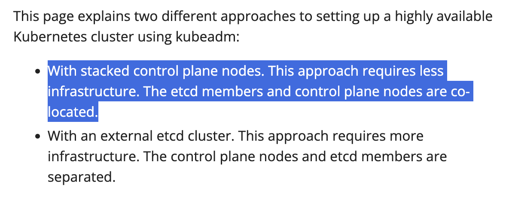
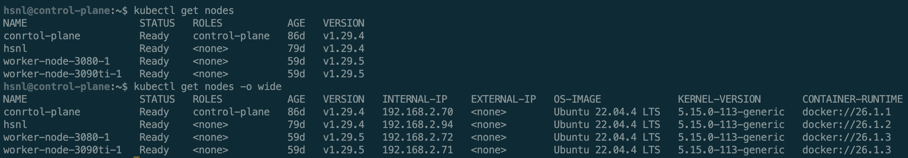
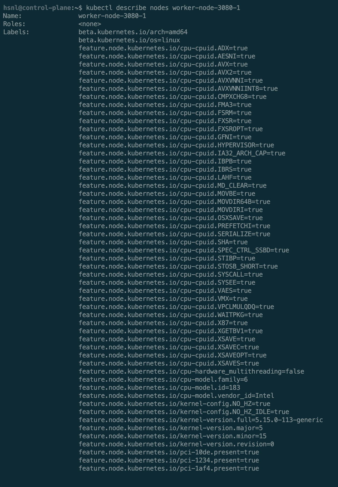
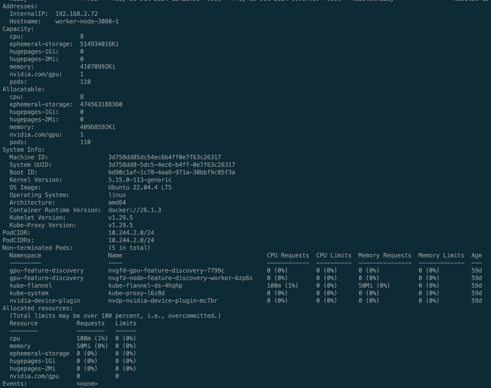

# Introduction to Kubernetes

Kuberentes（也被稱為 K8s）作為 Google 開源的容器化管理系統，主要用來自動化部屬、擴展和管理容器化應用程式。擁有許多特色與好用的功能，但也有一個很嚴重的問題，他「非常難以入門...」。

## References and Suggested Reading Order

雖然 Kubernetes 提供了非常完善的 Docs，但由於 Kubernetes 過於靈活 & 對於不同的「場景/情境」皆有各自的解決方案，且非常依賴於「Kubernetes 版本」的調整，為此本文針對實驗室 No Code AI Platform 所需知識整理了相關閱讀順序與整理，可以參考此文件進行學習與認識。

> 本文件假設閱讀者已經有基本的容器化概念 & Docker 等容器化技術的應用背景。

### Reading Order

- Overview of Kubernetes - Kubernetes 的概述
  - https://kubernetes.io/docs/concepts/overview/
  - 請藉由本文章「概略了解」Kubernetes 的資訊和存在的角色狀況。
- About Kubernetes Components - 關於 Kubernetes 的元件
  - https://kubernetes.io/docs/concepts/overview/components/
  - 請藉由本文章「初步瞭解」Kubernetes 的組成狀況和基本知識。
  - 可以稍微關注 kubeadm 這個初次出現的 Keyword，這是我們後續主要用來建立 Kubernetes 叢集的主要工具。
    - https://kubernetes.io/docs/setup/production-environment/tools/kubeadm/high-availability/
    - 此文章為介紹文件中額外提到「Highly Available Clusters」的資訊，短期間實驗室服務不會特別需要了解內部知識，但請注意我們採用本文中開頭的第一種做法建立叢集。
      > 
- The Kubernetes API
  - https://kubernetes.io/docs/concepts/overview/kubernetes-api/
  - 請藉由本文章「稍微了解」Kubernetes 是藉由 Kubernetes API 所運作與操作，且為整個 Control Plane 的核心即可。
- Cluster Architecture - 叢集架構
  - https://kubernetes.io/docs/concepts/architecture/
  - 請藉由本文章「快速了解」Kubernetes 的叢集架構（看一下那張圖片）& 看一下下方一堆 Link 中的各種東西即可，快速 Go Through 即可往下看。
- Nodes - 節點
  - https://kubernetes.io/docs/concepts/architecture/nodes/
  - 請藉由本文章「快速了解」Kubernetes 的「節點」是什麼。並注意出現的三個 Keyword：
    - [kubelet](https://kubernetes.io/docs/reference/generated/kubelet)
    - [container runtime](https://kubernetes.io/docs/setup/production-environment/container-runtimes)
    - [kube-proxy](https://kubernetes.io/docs/reference/command-line-tools-reference/kube-proxy/).
  - 後續操作時，可以參考此文件作為 Refs 來逐步了解互動概念，請把本頁面當作「參考資料」隨時參照。
- Setup - 設定
  - https://kubernetes.io/docs/setup/
  - 接下來請直接跳到「Setup」相關文章，以實作與建立環境來逐步了解內部資訊。
  - 建議先利用自己個電腦，開 VM 模擬與建立相關服務來認識整體運作，再到實驗室環境中操作，可以參照 [CTAI-Setup]() 來了解安裝順序 & 腳本。
- Install Tools - 安裝工具
  - https://kubernetes.io/docs/tasks/tools/
  - 請注意 kubectl / kubeadm 這兩個主要會用到的服務，其他可以視情況瞭解。
- Installing kubeadm - 安裝 kubeadm (請注意版本，實驗室目前版本為 1.29)
  - https://v1-29.docs.kubernetes.io/docs/setup/production-environment/tools/kubeadm/install-kubeadm/
  - 安裝概念：
    - 節點主要分兩種，一種為 Control Plane，另一種為 Worker Nodes。
    - 剛叢集剛剛準備被建立時，首先需要先有一個核心的 Control Plane，也就是初始化整個叢集，這一步驟可以從 Install Script 的 Control Plane Init 中看到。
      - https://kubernetes.io/docs/setup/production-environment/tools/kubeadm/create-cluster-kubeadm/
      - 有了這個主要 Control Plane 之後，可以建立更多的 Control Plane 來分散叢集管理節點下線的風險，或者可以建立各式各樣的 Worker 來為叢集工作。
    - 因此這時可以參考 Worker Nodes 的 Setup，你會看到很多為了成為合格的 Worker 才有的安裝與內容出現（例如 GPU Driver 的安裝）。
  - 了解 Container Runtimes - 容器運行時，相關資訊合適在這個位置
    - https://kubernetes.io/docs/setup/production-environment/container-runtimes/
- Command line tool (kubectl) - 命令列工具（kubectl）
  - https://kubernetes.io/docs/reference/kubectl/
  - 請藉由本文章「清楚了解」如何藉由 kubectl 操作與了解 Kubernetes 的狀態、操作，並貫穿與熟悉 `kubectl [command] [TYPE] [NAME] [flags]` 指令結構。
  - 了解並熟悉以下指令：
    - `kubectl get nodes`
    - `kubectl get nodes -o wide`
    - `kubectl get jobs`
    - `kubectl get jobs -o wide`
    - `kubectl get pods`
    - `kubectl get pods -o wide`
    - `kubectl describe nodes <node-name>`
    - `kubectl describe pods <pod-name>`
    - `kubectl logs pods <pod-name>`
- Containers - 容器
  - https://kubernetes.io/docs/concepts/containers/
  - 請藉由本文章「清楚了解」在 Kubernetes 的世界中，所有應用仍然是一個一個 Container 所組成，Container 作為容器化世界的「真正運作單位」，應該保有「單一、乾淨、明確」的基本原則，且保有「可複製、彈性」的特性，運行在每一個節點上。
  - 由於 container 是實際運作環境，因此應該靈活且嚴謹的管理其運作的「前、中、後」，請了解其 Container Lifecycle Hooks
    - https://kubernetes.io/docs/concepts/containers/container-lifecycle-hooks/
    - 請藉由本文章「快速了解」container 在 Kubernetes 世界中的生命週期與階段，並將此網頁作為後續參照。
- Workloads - 工作負載
  - https://kubernetes.io/docs/concepts/workloads/
  - 請藉由本文章「清楚了解」Kubernetes 世界中最小操作單位 Pod，與其相關擴充角色如 Deployment / Job / CronJob...。
  - 可以搭配 Objects 頁面了解相關資訊。
    - https://kubernetes.io/docs/concepts/overview/working-with-objects/
- Services, Load Balancing, and Networking
  - https://kubernetes.io/docs/concepts/services-networking/
  - 請藉由本文章「快速了解」Kubernetes 的基本互動與服務的概念，可以快速 Overview 即可。
- Storage - 儲存
  - https://kubernetes.io/docs/concepts/storage/
  - 請藉由本區塊「參照了解」要管理 Kubernetes 的資料互動的概念，由於專案會需要靈活與精細的操作資料們的共享與儲存，可以與 CTAI 專案中的 Template Yaml 參照閱讀。
- Configuration - 設定
  - https://kubernetes.io/docs/concepts/configuration/
  - 請藉由本區塊「參照了解」要管理 Kubernetes 的設定文件，並依照下方連結清楚了解 Resource Management for Pods and Containers
    - https://kubernetes.io/docs/concepts/configuration/manage-resources-containers/

### Other Reading List

- Scheduling, Preemption and Eviction - 調度、搶佔和驅逐
  - https://kubernetes.io/docs/concepts/scheduling-eviction/
  - 當需要更深入了解 Kubernetes Scheduling 邏輯與操作時，會需要深入了解。
  - Kubernetes Scheduler
    - https://kubernetes.io/docs/concepts/scheduling-eviction/kube-scheduler/
    - Kubernetes 的互動很精細，並且有許多評分標準來綜合決策「選擇」，如果需要介入，會需要更了解如何影響 Kubernetes 的選擇依據。
- Logging Architecture - 日誌架構
  - https://kubernetes.io/docs/concepts/cluster-administration/logging/
  - 可以用以了解 Kubernetes 監控與日誌相關資訊，當需要更精細的監控整個服務時，建議可以花時間閱讀。
- Cluster Architecture - 叢集架構
  - https://kubernetes.io/docs/concepts/architecture/
  - 用來了解整個結構。

### References

- https://kubernetes.io/docs/home/

## Overview of Kubernetes

Kubernetes 作為一個容器化管理平台，專有名詞非常複雜，什麼叢集呀工作節點呀非常複雜，因此我們決定換個角度說明與理解整個體系，這個對標方式就是「公司」。

### 用「公司」來認識 Kubernetes

在故事開始前，我們先進行一些名詞的對標。

#### 名詞轉換

- Cluster <-> 叢集 <-> 公司
- Control Plane <-> 控制平面 <-> 老闆
- Worker Node <-> 工作節點 <-> 員工
- Deployment <-> 部署
- W

#### 故事介紹

假如我們今天在一間公司工作，一般來說「老闆」會面試與應徵「員工」，面試與應徵的目的是了解「員工的詳細能力狀況」，並將相關資料記錄下來，用來確保後續可以分配「合適的任務」到「合適的員工」身上。

Kubernetes 的世界也是這樣，Control Plane 身為 Cluster 的大腦，負責管理與調度 Worker Nodes 執行對應的任務，用來確保該執行的工作與任務能被合適的運作，並確保整個系統不會損毀，也就是「公司不能被摧毀或損毀」。

這時我們在回頭想一下日常生活的工作，一般來說工作有分成很幾種類型，

- 一種是「會需要隨時保持運作的工作」，舉例來說公司的櫃檯或者客服，就需要隨時保持運作，且這種工作有機會需要「因應狀況增加減少人手」。
- 一種是「一次性任務」，舉例來說公司接受新的客戶需求，那這種任務可以考慮他「是否需要確保完成」。
- 另一種「重複性任務」，他會在特定條件成功時被觸發，舉例來說「公司內週會、月會」，或者「尾牙、春酒」這種「固定時間、特殊情境」會被觸發的工作。
  但回頭來說，他們都有一個「共同的最小任務單位」，而這些工作或任務都會有一個「任務成本」。

上述的情境其實也對應了 Kubernetes 中的各種觀念，分別是：

- 「會需要隨時保持運作的工作」在 Kubernetes 的世界是 Deployment，Deployment 更在乎的是需要重複啟動多少「同類型的任務」來支持所有服務上的需求。
- 「一次性任務」在 Kubernetes 的世界是 Job，Job 就是一個一次性任務，Job 會注意的是成功完成與否，會不會需要「重新執行任務」。
- 「重複性任務」在 Kubernetes 的世界則是 CronJob，CronJob 會是一個「特殊條件下觸發」的任務，CronJob 會注意的是「如何觸發與啟動」，但請注意，Kubernetes 的 CronJob 觸發條件蠻嚴格的。
- 「最小運作單位」在 Kubernetes 的世界則是 Pod，Pod 是 Kubernetes 世界中的最小操作單位，不管是上述的那一種任務都是由許許多多的 Pod 所組成，這些 Pod 會組成一個完整的「任務」。
  而一般來說，剛剛提到的，我有一個工作和任務時，我會需要指派這個任務到一個合適的「員工」身上，這時候會需要評估兩個部分，一個是「員工的能力」，另一個則是「任務的難度」，在 Kubernetes 的世界中，「員工的能力」等於 Worker Nodes 上有的資源狀況，而「任務的難度」則是每個任務上會寫著所需要的資源量，Kubernetes 會根據 Worker Nodes 可以提供的「可使用資源」跟新的任務的「所需要資源」和一些額外的評估資訊，選擇合適的「員工」完成「合適的任務」。

接下來我們會逐一拿實際範例說明。

## Examples for Each Samples

上面有提到的「公司」，也就是 Kubernetes 的「叢集」，主要由「最少一個 Control Plane 和最少一個 Worker Node」所組成。
如下圖可以看到，藉由 `kubectl get nodes` 指令可以看到目前 Kubernetes 叢集的狀態，並可以了解相關基本資訊。

> 

為了了解更詳細的節點資訊，並認識其資源狀況，可以藉由 `kubectl describe nodes <node_name>` 了解細節，其中從下圖二可以看到 Kubernetes 其實對工作節點的資訊管理的非常仔細，而 `Capacity` (容量) 跟 `Allocatable` (可分配) 就是 Kubernetes 判斷 Nodes 狀態的重要參數，Capacity 說明著這個工作節點註冊時系統硬體上的資源狀況，而 Allocatable 則是真正判斷目前節點可以使用的資源狀況，而 Kubernetes 就是參照 Allocatable 所回傳的資訊了解目前工作節點可以執行的任務量。

>  > 

我們現在已經知道「一個員工的極限」跟「一個員工目前的工作量」，那是時候了解「任務類型」跟「任務難度」了。要了解任務類型與難度，我們要看一下「任務文件」。
Kubernetes 在操作與認識工作項目，是靠著一份一份的「任務文件」，這個任務文件為一個又一個的 `.yaml` 文件，Kubernetes 藉由裡面的 Keywords 在認識與管理著這個文件，分別是

- `apiVersion`
- `kind`
- `metadata`
- `spec`
  我們先從一個 Example 的 `Pod` yaml 文件來看看：

```yaml=
# Example Pod
apiVersion: v1
kind: Pod
metadata:
	name: example-pod
spec:
	containers:
	- name: example-container
	  image: busybox
	  imagePullPolicy: Never
	  command:
	  [
	    "sh",
	    "-c",
	    "echo Hello, World! > /mnt/training_tasks/hello.txt; echo 'Completed writing to hello.txt'; sleep 60",
	  ]
	  resources:
	    requests:
	    memory: "5Gi"
	    cpu: "500m"
	  limits:
	    memory: "10Gi"
	    cpu: "1"
```

這個 YAML 文件定義了一個簡單的 Pod。讓我們逐一解釋其中的重要部分：

1. `apiVersion: v1`: 表示使用 Kubernetes 核心 API 的 v1 版本。
2. `kind: Pod`: 指定這是一個 Pod 資源。
3. `metadata`: 包含 Pod 的元數據，如名稱。
4. `spec`: 定義 Pod 的具體規格。
   在 `spec` 中，我們定義了容器的細節：

- `containers`: 定義 Pod 中的容器列表。
- `name`: 容器的名稱。
- `image`: 使用的容器映像。
- `imagePullPolicy: Never`: 指示 Kubernetes 不要嘗試從遠端倉庫拉取映像。
- `command`: 容器啟動時執行的命令。
  最重要的是 `resources` 部分，這就是我們前面提到的「任務難度」：
- `requests`: 容器請求的最小資源量。
  - `memory: "5Gi"`: 請求 5 GB 的記憶體。
  - `cpu: "500m"`: 請求 0.5 個 CPU 核心。
- `limits`: 容器可以使用的最大資源量。 - `memory: "10Gi"`: 最多可使用 10 GB 的記憶體。 - `cpu: "1"`: 最多可使用 1 個 CPU 核心。
  這就像是在說：「這個任務至少需要 5GB 記憶體和半個 CPU 核心才能執行，但最多不能超過 10GB 記憶體和 1 個 CPU 核心。」
  Kubernetes 的排程器（可以想像成公司的人力資源部門）會根據這些資源需求，找到合適的 Worker Node（員工）來運行這個 Pod（任務）。
  接下來，讓我們看看 Deployment 的例子：

```yaml=
apiVersion: apps/v1
kind: Deployment
metadata:
  name: nginx-deployment
spec:
  replicas: 3
  selector:
    matchLabels:
      app: nginx
  template:
    metadata:
      labels:
        app: nginx
    spec:
      containers:
      - name: nginx
        image: nginx:1.14.2
        ports:
        - containerPort: 80
```

Deployment 是管理 Pod 的更高層級資源。在公司的比喻中，可以將 Deployment 想像成一個部門或專案團隊：

- `replicas: 3`: 指定要運行 3 個相同的 Pod。就像說「這個專案需要 3 個人」。
- `selector` 和 `labels`: 用於識別哪些 Pod 屬於這個 Deployment。就像給團隊成員貼上標籤。
- `template`: 定義了 Pod 的規格，類似於我們之前看到的 Pod YAML。
  Deployment 確保始終有指定數量的 Pod 在運行。如果某個 Pod 失敗，Deployment 會自動創建一個新的來替代它，就像項目經理確保團隊始終保持足夠的人手。
  通過這些例子，我們可以看到 Kubernetes 如何通過 YAML 文件來定義和管理各種資源，就像公司通過職位描述和專案規劃來管理人力資源和工作任務。

我們特別補充一下 `apiVersion` 這個參數的資訊，apiVersion 指定了我們要使用的 Kubernetes API 的版本。這很重要，因為不同版本的 API 可能有不同的功能和語法。

- v1: 這是核心 API 組的穩定版本，包含了最基本的資源如 Pod、Service、ConfigMap 等。
- apps/v1: 這是 apps API 組的穩定版本，包含了與應用程式部署相關的資源，如 Deployment、StatefulSet 等。
- batch/v1: 這是 batch API 組的穩定版本，包含了與批次處理作業相關的資源，如 Job、CronJob 等。
  前綴（如 apps/、batch/）表示 API 組。這些組用於組織和分類不同類型的資源。
  關於 v2：Kubernetes 遵循語義化版本控制，但目前大多數資源仍在 v1。當有重大變更時，可能會出現 v2，但這種情況相對罕見。

以上就已經包含了 90% Kubernetes 的基本觀念與操作。
