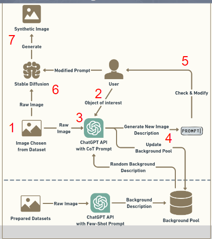

# ImgGenAI

- 此 repo 主要為將 generated AI 技術使用在 Data Augmentation 上
- ChatGPT + Stable Diffusion -> Synthetic Image 
    - 被視為 augmented image, 會在之後用在模型訓練中
- Workflow
    - 
    1. Target image chosen from dataset
    2. Get object of interest from user
    3. Give raw image from step 1, object of interest from step 2, random background description from background pool into ChatGPT API
    4. Generate new image description as prompt. Meanwhile, update the background pool
    5. Show the prompt from step 4 to user to review and modify it
    6. Give raw image from step 1 and modified prompt from step 5 to Stable Diffusion
    7. Stable Diffusion generates the synthetic image

## Components

### BG-Pool
- Background pool
- 使用 MangoDB
- 在流程中的作用為提供隨機的背景描述詞(Text)

### Generate Component
- Include utilization of ChatGPT + Stable Diffusion to generate synthetic image
- ChatGPT
    - 使用 [prompt.json](prompt.json) 中的 Prompt 來產生期望的 output
- Stable Diffusion
    - 主要調整其中的 strength & num_inference_steps 來達到不同的生成圖片效果

